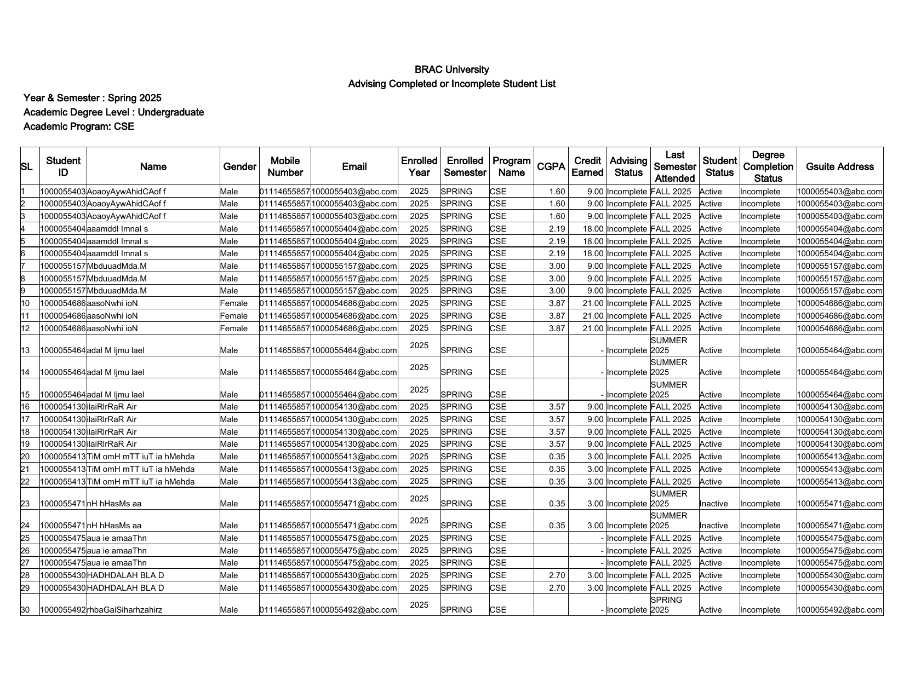
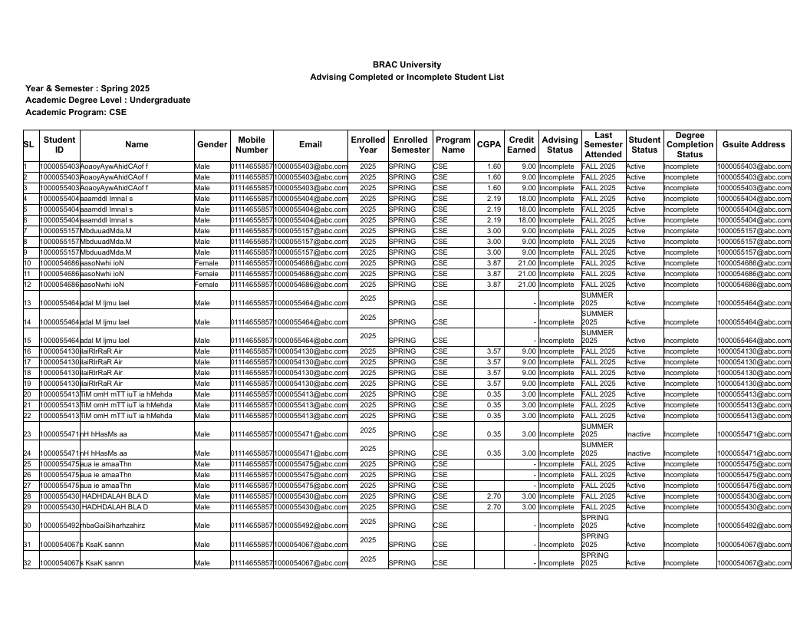

# htmltopdf

> World's fastest, leanest parallel HTML-to-PDF engine for serious server workloads.

[](https://www.rust-lang.org/)
[](#license)
[](#project-status)

`htmltopdf` is a Rust HTML-to-PDF engine designed for high concurrency, low RAM,
low CPU overhead, and browser-grade rendering fidelity over time. The core idea
is simple: render many documents in parallel inside one process, without
launching Chromium, Puppeteer, or a browser subprocess per job.

The project is built around a real rendering pipeline: HTML parsing, compact DOM,
CSS parsing, cascade, box generation, layout, display-list painting, and a
streaming compressed PDF writer.

```text
HTML -> html5ever -> arena DOM -> cssparser -> cascade
     -> box tree -> layout -> display list -> compressed PDF
```

## htmltopdf vs Chromium

Same input (`reg-2-9-1.html`, a real 1.8 MB spreadsheet export with ~22k table
cells), rendered to PDF page 1 — left is `htmltopdf`, right is headless Chromium
(`--print-to-pdf`). Both engines pick the font from the document's own
`font-family: Calibri/Arial` CSS — htmltopdf resolves, embeds, and subsets the
real Arial + Arial Bold faces itself (no `--font` flag needed).

| htmltopdf | Chromium |
| --- | --- |
|  |  |

Bold headers, font size, gridline weight, column widths, header wrapping, and
per-page row counts line up closely (33 pages vs Chromium's 32).

> ### ⚡ Cost of that conversion
>
> Full 33-page document (32 for Chromium), measured back-to-back with
> `/usr/bin/time -l` on one machine (Apple Silicon, macOS), 2026-07 build with
> real font-family resolution, shaping, and per-face subsetting enabled:
>
> | Metric | **htmltopdf** | Chromium (headless) | Advantage |
> | --- | --- | --- | --- |
> | **Wall time** | **≈ 0.64 s** | ≈ 2.4 s | **≈ 4× faster** |
> | **Peak RAM** | **≈ 92 MB** | ≈ 846 MB (main process alone) | **≈ 9× less** |
> | **Output size** | 0.9 MB | 8.0 MB | ≈ 9× smaller |
> | **Process model** | one thread, no subprocess | full browser + renderer processes | — |
>
> The RAM gap is the whole point: Chromium needs a browser (~850 MB) per
> concurrent conversion, while htmltopdf renders many documents in one small
> process — so throughput per GB of RAM is dramatically higher on a server.
> Development measurements on one fixture/machine, not a guarantee.

### 20-way concurrent conversion baseline

Twenty identical conversions were launched at once, using the release CLI for
htmltopdf and 20 fresh headless Chrome profiles. The reported endpoint is when
the last PDF is written. Both runs produced all 20 PDFs per engine on Apple
Silicon macOS (July 2026).

| Fixture | htmltopdf: wall / throughput / peak RSS | Chrome: wall / throughput / peak RSS | Result |
| --- | --- | --- | --- |
| [Simple one-page HTML](examples/concurrency-simple.html) (770 B) | **0.077 s** / **261.37 PDF/s** / **57.2 MiB** | 6.582 s / 3.04 PDF/s / 11.49 GiB | **86×** throughput, **206×** lower peak RSS |
| `reg-2-9-1.html` (1.8 MB, ~22k table cells) | **1.568 s** / **12.75 PDF/s** / **1.25 GiB** | 17.002 s / 1.18 PDF/s / 9.35 GiB | **10.8×** throughput, **7.5×** lower peak RSS |

htmltopdf's RSS is its one multi-worker process, measured by
`/usr/bin/time -l`. Chrome RSS is the peak sum of every browser, renderer, and
helper process belonging to the 20 isolated profiles, sampled every 100 ms. For context, CPU
usage was 0.14 / 15.96 htmltopdf CPU-seconds and approximately 9.91 / 28.99
Chrome process-tree CPU-seconds (simple / complex); Chrome's sampled CPU peaks
were 765% and 603%. Chrome may retain idle helpers after writing a PDF, so the
benchmark ends at PDF readiness and terminates only processes carrying its
unique run tag.

Reproduce with
[`scripts/benchmark-concurrency.sh`](scripts/benchmark-concurrency.sh):

```bash
bash scripts/benchmark-concurrency.sh examples/concurrency-simple.html 20
bash scripts/benchmark-concurrency.sh reg-2-9-1.html 20
```

## Why htmltopdf?

- **Fast by design**: independent render jobs scale across CPU cores.
- **Minimal RAM**: compact arena-based DOM, index-based data, and no browser
  renderer process per conversion.
- **Parallel-first**: CLI benchmarks and the HTTP server are built around
  worker-level parallelism.
- **Real HTML parser**: uses `html5ever`, not ad hoc tag scanning.
- **Real CSS parser**: uses `cssparser` for stylesheet tokenization and cascade
  support.
- **Selectable compressed PDFs**: generated text stays searchable/selectable.
- **Unicode font support**: optional TrueType/OpenType embedding with Type0 /
  Identity-H PDFs, ToUnicode maps, and TrueType glyph subsetting when possible.
- **Raster images**: `` JPEG and PNG (including alpha) from file paths and
  `data:` URIs, embedded as PDF image XObjects — JPEG passes through untouched
  via `DCTDecode` and PNG is decoded in-house, so no image-codec dependency.
- **Small dependency surface**: no async runtime, no browser, no web framework.

## Project Status

This is an early engine, not a complete browser. The long-term goal is full CSS
and controlled JavaScript support with much lower memory cost than
Chromium-based renderers.

Works today:

- HTML parsing through `html5ever`.
- CSS parsing and cascade for supported selector/declaration subsets.
- Type, universal (`*`), id, class, and attribute selectors (`[a]`, `[a=b]`,
  `~= |= ^= $= *=`); descendant/child/sibling combinators (` `, `>`, `+`, `~`);
  structural pseudo-classes (`:first-child`, `:nth-child()`, `:*-of-type`,
  `:empty`, `:root`, `:not()`); `@media print` queries; specificity, source
  order, inheritance, and `!important`.
- Basic flow documents: headings, paragraphs, lists, inline runs, blockquotes —
  and tables rendered inline with the surrounding flow content.
- Tables: rows, cells, colspans, **rowspans** (spanning cells paint once across
  their rows, later rows shift into the freed columns, and a span crossing a
  page break is split per page), headers/footers, borders, backgrounds,
  alignment, wrapping, clipping, and repeated table headers — with **rich cell
  content**: mixed bold/color/size segments, clickable links, and RTL text
  inside cells (plain cells keep the fast single-style path).
- CSS colors, font sizes, bold text (rendered as faux-bold fill+stroke), text
  alignment (including `text-align: justify`), text decoration
  (underline/line-through), margins, padding (with vertical margin collapse),
  `line-height`, and backgrounds: solid color, `linear-gradient()` (blocks and
  table cells), and `background-image: url()` raster images on flow blocks
  (`background-size`/`-position`/`-repeat`, tiled and clipped to the box).
- **`display: inline-block`**: an element that is a block box (padding, border,
  background, `border-radius`, CSS width/height) but flows on the surrounding
  line as an atomic item aligned to the text baseline — badges, buttons, tags,
  chips, color swatches — with the surrounding text flowing around it and
  wrapping. (First slice: single-line inner content.)
- **Percentage lengths and min/max sizing**: `%` widths, padding, margins, and
  positioned-box offsets resolve against the containing block;
  `min-width`/`max-width` (points or `%`) and `min-height`/`max-height` (points)
  clamp the box; `overflow: hidden` with a fixed height clips content to the
  border box; `box-sizing: border-box`.
- **CSS custom properties**: `--name: value` declarations cascade and inherit,
  and `var(--name, fallback)` resolves — including variables that alias other
  variables, fallbacks for missing variables, and component-scoped overrides
  that recolor a subtree by redefining a variable on an ancestor.
- **`calc()` expressions**: `+ - * /`, parentheses, nested `calc()`, and unit
  mixing. A mixed `calc(100% - 20px)` resolves against the containing block at
  layout time (width, padding, margin, offsets); `calc()` composes with `var()`.
- **Typographic control**: `text-transform` (uppercase/lowercase/capitalize —
  measurement sees the transformed text, and `th` cells uppercase correctly),
  `letter-spacing` (positive or negative, reproduced via the PDF `Tc` state so
  kerning survives), `word-spacing`, and `text-indent` (points or `%`,
  first line only).
- **`::before`/`::after` generated content**: quoted strings (with CSS hex
  escapes), `attr()`, and concatenation — required-field asterisks, badge
  prefixes, printing link hrefs after anchors — with the pseudo rule's own
  styling (color, weight, size, spacing) applied to the generated text.
- **Real borders**: per-side `border-top/right/bottom/left` with independent
  width, style, and color — `solid`, `dashed`, and `dotted` (double/groove/
  ridge render solid), `thin/medium/thick`, `currentColor` defaults. Borders
  consume layout space and backgrounds extend under them, like a browser.
  **`border-radius`** rounds card backgrounds and uniform borders (Bézier
  paths); **`box-sizing: border-box`** is honored on blocks, floats, and
  positioned boxes. Table cells take per-side rules too — the classic
  `th { border-bottom: 2px solid }` paints exactly that edge, while uniform
  spreadsheet gridlines keep the fast path.
- Modern layout, first pass each: **flexbox** (`display: flex` — grow/basis/
  `flex-shrink`, `order`, `flex-wrap`/`wrap-reverse`, `justify-content`,
  `align-items`/`align-self`/`align-content`, gaps, row and column), **grid**
  (`display: grid` — fixed/`fr`/`auto`/`repeat()`/`minmax()` column *and*
  `grid-template-rows` tracks, 2D `grid-column`/`grid-row` line placement and
  row spans on an occupancy grid, `grid-template-areas`/`grid-area` named
  placement, `align-items`/`align-self`, gaps),
  **floats** with real text wrap (`float: left/right`, `clear`, stacked floats),
  and **positioning** (`position: relative/absolute/fixed` with box offsets;
  `z-index` ordering with negative z painting *below* the flow — the
  `z-index: -1` background-layer pattern; CSS `width` and `height` on blocks).
- **Text shaping** (HarfBuzz via `rustybuzz`) for embedded fonts: kerning
  reproduced in the PDF, ligatures with extractable text, Arabic joining forms.
- **Bidirectional text + RTL paragraphs** (UAX #9): mixed LTR/RTL lines — an
  Arabic or Hebrew phrase inside an English sentence — reorder into correct
  visual order, and the PDF text stays extractable in logical order.
  `dir="rtl"` / `direction: rtl` set the base paragraph direction (inherited),
  flipping the bidi base level and right-aligning by default.
- **Font fallback chains**: characters the chosen font lacks (CJK, Hangul,
  Cyrillic, …) automatically fall back to a covering system face, each embedded
  as its own subset font — a Chinese/Japanese/Korean invoice renders correctly
  with no flags at all.
- **Per-element `font-family` with real bold/italic faces**: named families
  and CSS generics resolve to real system faces (including true bold and
  italic variants — no more synthesized bold when a family is known), several
  subset faces per document; `pre`/`code` default to monospace.
- **`@font-face` web fonts**: an author-declared family shadows system lookup.
  `src:` chains work like a browser's — unsupported candidates (WOFF2) are
  skipped, `url()` loads TrueType/OpenType/**WOFF** from `data:` URIs and
  local files (remote `http(s)` behind the same opt-in policy as remote
  images), `local()` resolves system faces by family, full, or PostScript
  name. Multiple rules per family select real bold/italic variants by
  `font-weight`/`font-style`.
- **Clickable links and a document outline**: `<a href>` becomes a real PDF
  link annotation — external URIs, `mailto:`, and in-document `#fragment`
  jumps to `id` anchors — styled with browser UA defaults (blue, underlined;
  `text-decoration: none` and author colors respected). Headings build the
  PDF bookmark sidebar (`h2` nests under `h1`, and so on).
- **Paged-media running headers, footers, and page numbers**: CSS `@page`
  margin boxes (`@top-left/center/right`, `@bottom-left/center/right`) paint
  static text plus final `counter(page)` / `counter(pages)` values after the
  document has been paginated.
- `` images: JPEG (`DCTDecode` pass-through) and PNG (decoded in-house,
  alpha as a soft mask), from file paths and `data:` URIs, with
  `width`/`height` sizing and aspect-ratio preservation. An image sharing a
  line with text flows **inline** on the baseline (icons, badges — clickable
  inside a link); standalone images render block-level and floated ones wrap
  text around them.
- Pagination, page margins, landscape pages, compressed PDF streams.
- Built-in Helvetica metrics and optional embedded TrueType/OpenType fonts.
- Font subsetting for `glyf`-based TrueType fonts, with full-font fallback for
  formats that cannot be subset yet.
- CLI, Rust library API, and lightweight HTTP API.

Opt-in (behind build features):

- A bounded pre-layout **JavaScript** stage (Boa) that runs inline `<script>`s
  against a live DOM and mutates it before layout: `getElementById`,
  `textContent`, `get/setAttribute`, `innerHTML` (get/set), `createElement`,
  `createTextNode`, `appendChild`, `removeChild`, and `document.body` — enough
  to build a whole document from script. Every run is capped by node/iteration
  budgets. Enable with `--features js` and pass `--js` (CLI) or use
  `Engine::render_html_with_scripts`.
- **Remote `http(s)` images** (`--features remote-images`, blocking `ureq`): a
  synchronous fetch for `` URLs, **fail-closed** by design — nothing is
  fetched unless the caller opts in per render (`--remote-images` on the CLI, or
  `RemoteImagePolicy { enabled: true }`). Even when enabled it enforces a byte
  cap, a timeout, and an SSRF guard that rejects loopback/private/link-local
  hosts and refuses redirects. Off by default so the base engine pulls no
  networking or TLS stack.

Out of scope by design (static print target):

- Dynamic pseudo-classes (`:hover`, `:focus`, `:active`) and CSS transitions /
  animations — they can never fire in a static PDF, so selectors using them are
  dropped rather than misapplied.
- Mid-script layout reads (`getBoundingClientRect`, …) — rejected by design so
  the JS stage stays a pure pre-layout DOM mutation (ADR 0009).

Not complete yet (queued, CSS-first):

- Remaining background layers: `url()` images on **table cells** (flow blocks
  already paint `url()` with size/position/repeat), radial/repeating gradients,
  multiple layers, and `background-origin`/`-clip`.
- `%` **heights** (`%` widths/padding/margins/offsets and `min-width`/
  `min-height`/`max-height` already work; height percentages need a definite
  containing height, which is indefinite in normal flow).
- `display: inline-block` — the atomic inline-level block box.
- Grid leftovers: named grid *lines*, dense packing, and
  `justify-items`/`justify-self`; plus border polish (real `double`/`groove`,
  per-corner radius, `border-collapse`). (Flex item leftovers and most of grid —
  `grid-template-rows`, 2D `grid-row` placement/spans, `grid-template-areas`,
  `align-items`/`align-self` — shipped.)
- Isolated stacking contexts (`z-index` compares globally today; negative z
  already paints below the flow, but `opacity`/`transform` don't create
  contexts).
- WOFF2 `@font-face` sources (needs a Brotli decoder; TTF/OTF/WOFF1 work);
  synthetic italic when no italic face exists; emoji (color fonts can't embed
  as outlines); `dir="auto"` and bracket mirroring.
- Broader JavaScript DOM surface (deferred): `insertBefore`, `cloneNode`,
  `querySelector(All)`, `parentNode`/`children` traversal, events, timers.
- `object-fit`; SVG and canvas; tagged PDF; images and nested block layout
  inside table cells; full visual compatibility with Chromium.

See [docs/COVERAGE.md](docs/COVERAGE.md) for the full ✅/🟡/❌ support matrix,
and [OVERVIEW.md](OVERVIEW.md), [IMPLEMENTATION.md](IMPLEMENTATION.md), and
[PLAN.md](PLAN.md) for the deeper roadmap and benchmark history. A Chromium
parity harness (`crates/htmltopdf/tests/parity_tests.rs` + fixtures) guards
every shipped feature; `scripts/compare-parity.sh` diffs rendered pages against
headless Chrome.

## Quick Start

### Requirements

- Rust 1.86 or newer
- Cargo

### Build

```bash
cargo build --release
```

### Convert HTML to PDF

```bash
cargo run --release -p htmltopdf-cli -- examples/invoice.html out/invoice.pdf
```

Embed a font by file path or installed system family name:

```bash
cargo run --release -p htmltopdf-cli -- --font Georgia examples/invoice.html out/invoice.pdf
cargo run --release -p htmltopdf-cli -- --font /path/to/font.ttf input.html output.pdf
```

## CLI

```bash
htmltopdf [--font <path|family>] [--paper a4|letter] [--js] [--remote-images] <input.html> <output.pdf>
htmltopdf bench <input.html> <output-dir> [runs]
htmltopdf bench-concurrent <input.html> <output-dir> <workers> <runs-per-worker>
```

Relative `` and `@font-face url()` paths resolve against the input
file's directory. `--remote-images` opts into fetching `http(s)` URLs (needs a
build with `--features remote-images`; fail-closed and SSRF-guarded otherwise).

`--js` runs the bounded pre-layout JavaScript stage and requires a build with the
`js` feature: `cargo run --release -p htmltopdf-cli --features js -- --js in.html out.pdf`.

Examples:

```bash
cargo run --release -p htmltopdf-cli -- reg-2-9-1.html out/report.pdf
cargo run --release -p htmltopdf-cli -- bench reg-2-9-1.html out/bench 10
cargo run --release -p htmltopdf-cli -- bench-concurrent reg-2-9-1.html out/bench 16 4
```

## HTTP Server

Start the server:

```bash
cargo run --release -p htmltopdf-server
```

By default it binds to `127.0.0.1:8080`. You can override the address and worker
count:

```bash
HTMLTOPDF_WORKERS=24 cargo run --release -p htmltopdf-server -- 0.0.0.0:9000
```

Endpoints:

| Method | Path | Description |
| --- | --- | --- |
| `POST` | `/render` | Request body is HTML, response is `application/pdf` |
| `GET` | `/health` | Liveness check |
| `GET` | `/` | Usage text |

Render with `curl`:

```bash
curl -X POST http://127.0.0.1:8080/render \
  -H 'Content-Type: text/html' \
  --data-binary @examples/invoice.html \
  -o invoice.pdf
```

Render with options:

```bash
curl -X POST 'http://127.0.0.1:8080/render?landscape=true&margin=36&font=Georgia' \
  --data-binary @examples/invoice.html \
  -o invoice.pdf
```

Supported query parameters:

| Parameter | Example | Description |
| --- | --- | --- |
| `landscape` | `true` | Force A4 landscape output |
| `margin` | `36` | Set all page margins in PDF points |
| `font` | `Georgia` | Embed a font by family name or file path |
| `js` | `true` | Run the bounded pre-layout JavaScript stage (needs a server built with `--features js`; rejected otherwise) |

JavaScript is strictly opt-in at every layer: without the `js` build feature it
isn't compiled in; without `js=true` (server) / `--js` (CLI) the script stage is
never entered — a script-free render pays zero JS cost.

Load-test the API:

```bash
cargo run --release -p htmltopdf-server -- 127.0.0.1:8123
scripts/api-convert.sh -c 16 -n 64
scripts/api-convert.sh -c 8 -n 32 -q 'landscape=true&font=Georgia'
```

## Rust API

```rust
use htmltopdf::{Engine, FontSource, RenderOptions};

fn main() -> Result<(), Box<dyn std::error::Error>> {
    let html = "<h1>Invoice</h1><p>Hello from Rust.</p>";

    let options = RenderOptions::default()
        .with_font(&FontSource::Family("Georgia".to_string()))?;

    let pdf = Engine::new().render_html(html, options)?;
    std::fs::write("invoice.pdf", pdf)?;

    Ok(())
}
```

## Architecture

The workspace contains three crates:

```text
crates/htmltopdf          Core rendering engine
crates/htmltopdf-cli      Command-line interface and benchmark commands
crates/htmltopdf-server   Lightweight thread-pooled HTTP API
```

Important engine modules:

| File | Responsibility |
| --- | --- |
| `dom.rs` | `html5ever` integration and compact arena DOM |
| `html.rs` | CSS parsing, cascade, computed styles, box generation, `@font-face` |
| `box_tree.rs` | Nested flow box tree |
| `layout.rs` | Pagination, line breaking, tables, flex/grid, floats, positioning, borders |
| `paint.rs` | Backend-neutral display-list commands |
| `pdf.rs` | PDF writer, compression, Type0/Identity-H embedding, image XObjects, links/outline |
| `image.rs` | `` + font `url()` byte loading: `data:` URIs, JPEG headers, in-house PNG decode |
| `font.rs` | Font resolution/metrics, HarfBuzz shaping, fallback chains, WOFF1, `@font-face` loading |
| `subset.rs` | Retain-GIDs TrueType glyph subsetter for embedded fonts |
| `script.rs` | Bounded pre-layout JavaScript stage (`ScriptEngine`; Boa behind `js`) |

The display-list boundary is intentional. Layout produces neutral paint
commands; the PDF backend consumes them. That keeps the engine extensible for
future rendering targets and makes layout independent from raw PDF syntax.

## Performance

The current benchmark fixture is `reg-2-9-1.html`, a real-world 1.8 MB
spreadsheet-like HTML file with roughly 22k table cells.

Measurement history (details in [IMPLEMENTATION.md](IMPLEMENTATION.md)):

| Scenario | Result |
| --- | --- |
| Single render, early table-aware layout | about 0.15s, about 20.6 MB peak RSS |
| Wrapped table layout | about 189 ms average over 5 runs |
| Parsed CSS cell styles | about 218 ms average over 5 runs |
| 16-worker benchmark | about 23-25 ms average wall time per PDF in earlier runs |
| Full pipeline, base-14 Helvetica only (2026-07) | about 0.36 s, about 77 MB peak RSS |
| Full pipeline + real Arial resolution/embedding (current) | about 0.64 s, about 92 MB peak RSS |

The current default is doing strictly more work than the earlier rows: it
honors the document's `font-family`, embeds and subsets real Arial + Arial
Bold, shapes text, and reproduces kerning — the earlier builds substituted
built-in Helvetica metrics for everything. Features shipped since (rich table
cells, `@font-face`, the real border model) are **byte-identical** on this
fixture — a fast path keeps plain spreadsheet cells and unbordered boxes on
the exact prior code — so the numbers above still hold.

These numbers are development baselines, not a final performance guarantee.
Every major rendering feature should be benchmarked against fixed fixtures so
speed and memory stay visible as fidelity improves.

## Roadmap

The queue is **CSS-first**: since the output is a static PDF, dynamic CSS
(`:hover`, transitions, animations) is out of scope by design, and the JS DOM
surface is deferred. Recently shipped: the flex item leftovers (`order`,
`flex-shrink`, `align-self`, `align-content`, `wrap-reverse`), the grid row axis
(`grid-template-rows`, `align-items`/`align-self`), 2D `grid-row` placement + row
spans on an occupancy grid, and `grid-template-areas`/`grid-area` named
placement (2026-07-13). The front of the queue, in order (see
[IMPLEMENTATION.md](IMPLEMENTATION.md) for the full checklist):

1. Grid leftovers (named grid *lines*, dense packing,
   `justify-items`/`justify-self`) and border polish; isolated `z-index`
   stacking contexts.
2. Remaining background & inline-block pieces: `url()` on table cells,
   radial/repeating gradients, multiple layers; multi-line / nested-block
   inline-block content and non-baseline `vertical-align`.
3. `min()`/`max()`/`clamp()` math functions; `%` heights (needs a definite
   containing height) and multi-page overflow clipping; general `counter()` in
   generated content (page counters are available in `@page` margin boxes).

Then, further out: WOFF2 web fonts, SVG, the broader scriptable DOM surface
(`querySelector`, traversal) on demand, and HTTP server hardening for
production deployment patterns.

## Author

Sanzar Rahman

## Design Principles

- Low RAM per render.
- Parallel rendering with no shared global mutable state.
- Real parser and cascade foundations before broad feature claims.
- Browser-compatible behavior over time, implemented honestly in layers.
- Deterministic server behavior with explicit limits for expensive features.

## License

This project is licensed under the MIT license.
